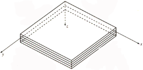
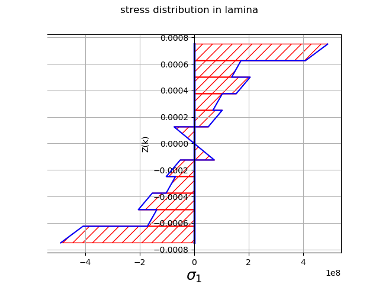
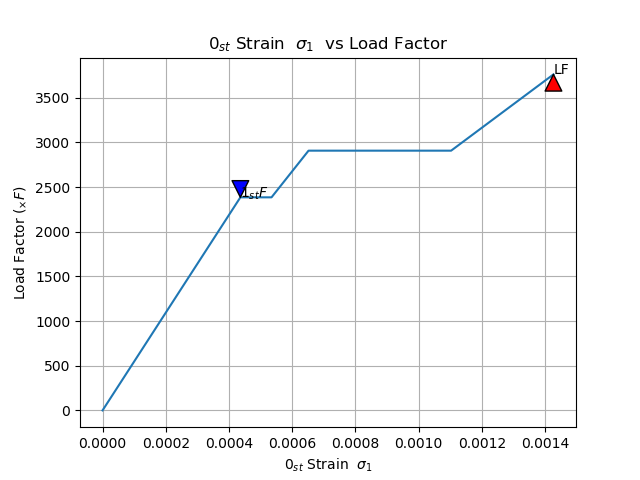
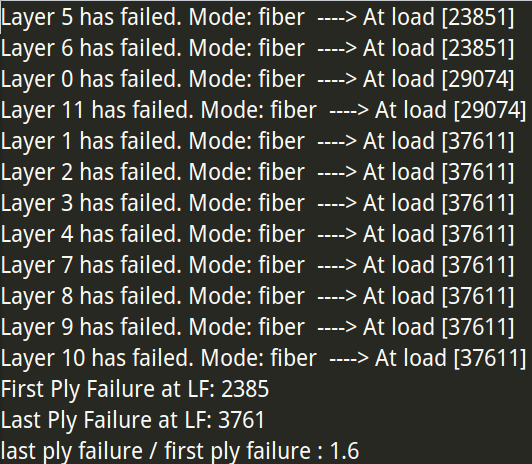

Introduction
====================

| |CN|ENG|   |
|---|----|-----|-----|
|1|`复合材料层合板计算`|[Composite Material Calculation with CLT][CLT]| [Introduction](#composite-material-calculation-with-clt)|
`read the program introduction for more details ` [Here](/doc/pro_introduction.pdf)  
[Running requirements](#running-requirements) | [Installation](#installation) | [License](#license) 

#### Project code for Mechanics of Composite Structure IN NPU,PARTLY FINISH.
#### ALL RIGHT RESERVED
********************************
## Project goals:
- Use the fibre and matrix or given data to define the composite lamina and then layup the laminate.
- Use the *Classical Lamination Theory* to  calculate the stress&strain distribution in each layer.
- Choose suitable *Failure Criteria* to check the strength of laminate at given load.
- Show accurate calculate information of results, display figures of  stress&strain distribution; show the failure steps of chosen layer.

## Data flow of the Project

## Task achieved:
- [x] Use CLT to calculate  stresses and strains distribution in lamina & laminate in local and global coordinate systems
- [x] Elastic modulus  calculate  for  lamina with [mixture of law , VDI2014 , Chamis model .....]
- [x] Global elastic modulus  calculate  for  __laminate__ 
- [x] Failure criteria [Tsai-Wu, Tsai-Hill, Hoffman, Max stress&strain ...]
- [x] Display the figures and report accurate results
- [x] Puck failure criteria
- [ ] Thermal & moisture effects on CLT calculations
- [ ] Database for Fibre and Matrix, laminate materials 
- [ ] ...

## Brief intro
### Coordinate System
 * xy is the Global System for __laminate__
 * 12 is the Local system for __lamina__

### Composite Material Calculation with CLT
* The main package is a Python composite materials calculation package.
The calculation of laminate stress, strain and failure Criterion based on the Classical Lamination Theory ([CLT](https://en.wikipedia.org/wiki/Composite_laminates)).  

	- You can define the lamina's fibre and matrix's parameters like the Elastic moduli
	,
	 Shear moduli  and strength, then  in the next step, you can define lamina's layer angle and thickness directly or combined by fibre/matrix.
		
	- Use the ***Laminate class*** to get the matrix such as .

	- Use the ***Load class*** and load force and moment to the laminate to calculate the stress  and stain  of each lamina.

	- Use the ***Failure_Cirterion class*** and you can choose different theories to check witch lamina failure or not.

* The *laminate_Tools.py* can help to plot the stress and strain distribution in the laminate in the COS(xy or 12), print the results in _Excel_ formate  and save it in _Excel_.

## Run failure analysis
Run  failure analysis by adding load step by step , use *laminate_step_failure.py* can  plot the Load Factor vs  the strain development of the chosen laminate, at the same it can mark the First Ply Failure and Last Ply Failure.

  > It may take some more time to run the process
 
 

*****************************************************
### Running requirements
	Python > v2.7
	Numpy
	Scipy
	Sympy
	matplotlib

### Installation         
>Copy the source files in the local directory and add the PATH in the system or copy the files to the Python's "site-packages" folder.  
>Copy the source file in you own file and develop the new function by yourself.

### License
#### Project code for Mechanics of Composite Structure IN NPU,PARTLY FINISH.
#### ALL RIGHT RESERVE
---------------------------------------------------------
[CLT]:https://github.com/Eacaen/CLT-material-properties  "CLT"
 
